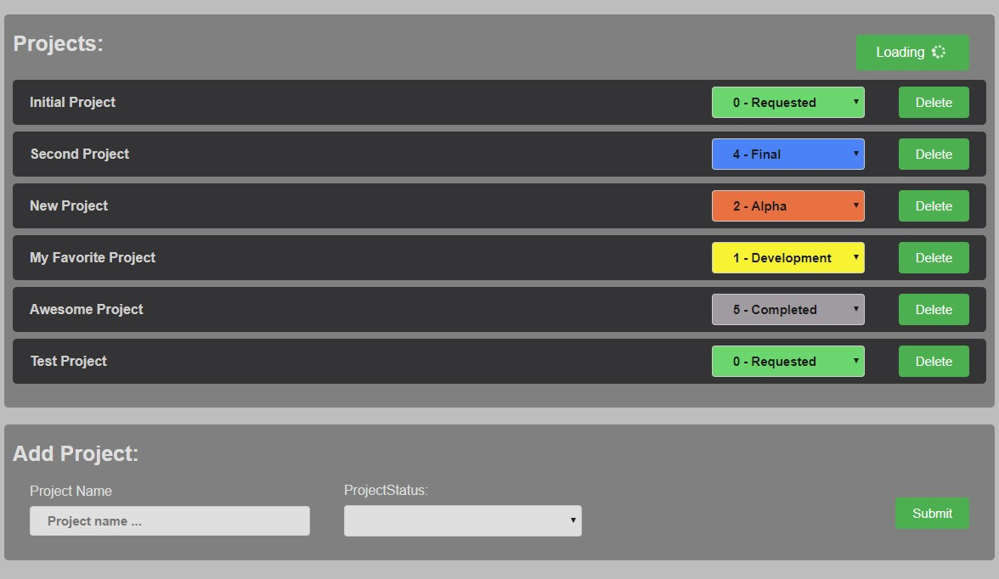

# What is this wizardry?

This project is a prototype for my Django "project cache" that I implemented for a business client in order to have almost real time 
content updates (similar to FireStore but polling the data instead pushing). I looked for some similar implementation 
but couldn't find something that worked for me, so here we are.

I decided to make it into a public demo in case someone else needs it.
I have plans to extend it into a stand-alone package, but ... later, when I'll have some time.

I'll add a tutorial for this on my website soon(tm)

## What does it do:
* It **creates a "cache"** that is order by access and has expiry time.
* It "listens" to changes on specific Opbject types (Projects) and whenever a client change is intercepted the Object is added to top of the cache.
* If the object was already in the cache it is moved to top of the queue.

The client can request changes since last time the cache was queried, so we can implement a polling task at an interval of choice.
The response contains the id's of the projects that have changed in the mean time. The client will then query only these projects.
If the cache is not old enough the client can run a full query.




Future changes/ideas:
- add the projects to the cache, so that no extra query is needed
- make it multiprocess safe
- etc ...

**IMPORTANT NOTE!!!: This is a demo, it is not production safe.**

## How does it work
Django uses the cache in the way explained above.

In `models.py` we use signals to listen to changes.

In `views.py` you can see besides the standard ViewSet, another function view `update()` that responds to requests.

... more explanations to follow ...

## Install and run
Assumes python 3 installed correctly 
1. Get this repo locally (clone or unzip)

2. CD into base dir, create venv and run DRF server
```
virtualenv venv
  or 
python3 -m venv venv

pip install -r requirements.txt
py manage.py makemigrations
py manage.py migrate
py manage.py runserver
```
!!! make sure that server is listening to `http://127.0.0.1:8000/`, otherwise update the baseURI in `ui/store/index.js` accordingly.

3. From a second shell, CD into `ui/` folder, to start up the Vue app.
```
npm install
npm run serve
```
4. Visit VUE server link, usually `http://localhost:8080/`

Open in 2 browsers side by side, to see the magic happen.

Click "Load" button on both instances, it should animate.

Make changes on either side, the changes should propagate to the other side in few seconds.
